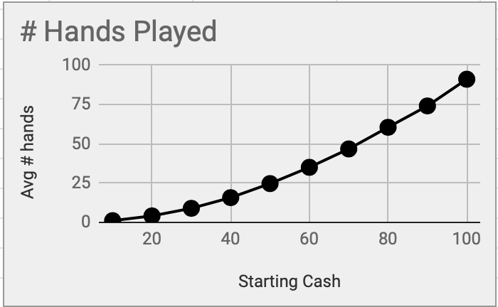
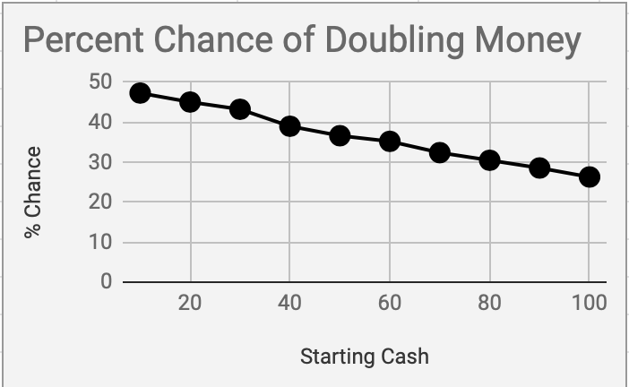

I recently came back from spring break, a portion of which I spent at a casino on a cruise ship. While everybody knows the house always wins and casinos are a waste of money, they can still be fun. I began my gambling by limiting the money I put on the table to reduce the amount of money I would lose. What I quickly realized, however, is that showing up to a $10 minimum table with $30 left me without cash very quickly. Instead of $30 a night, for three nights, I would be better off doing $90 for 1 night because I could then survive streaks of loses in order to experience streaks of wins. So I simulated it.

Below is code that simulates 10,000 games of roulette, assuming a $10 bet on red every roll. The simulation stops playing when it runs out of money or doubles its money.

```python
import random

win_prob = 47368 #roulette
wins=hands=iterations = 0

while (iterations<10000):
    iterations+=1
    cash = 10
    while((cash>0) and (cash<20)):
        hands+=1
        rand = random.randint(1,100000)
        if rand>win_prob:
            cash -= 10
        else:
            cash += 10
    if cash>=20:
        wins+=1

hands /= iterations
print(hands, wins)
```

And below are the results:




What this shows is the more money you start with, the longer you can play for. $20 will average you 4 hands, whereas $100 will average you 90 hands. Even playing $20 5 times will not come close to starting with $100. The tradeoff here is it reduces your odds of doubling your money.

These are both statistically and intuitively true. 
